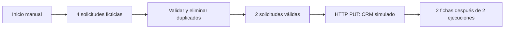

# CDRXRX — ejemplo ejecutable de automatización n8n

**Demostración técnica con datos ficticios; no es un proyecto de cliente.**

Cuatro solicitudes simuladas entran en el flujo. Se normalizan los datos, se descartan un duplicado y un correo inválido, y se envían dos solicitudes HTTP a un CRM de prueba. Al repetir la ejecución se actualizan las mismas dos fichas: no aparecen cuatro contactos.



## Pruebas realizadas

- Cuatro pruebas de validación pasan: normalización, campos permitidos, registros inválidos y duplicados.
- Dos ejecuciones reales en n8n: **4 llamadas HTTP, 2 fichas únicas** en el CRM simulado.
- El verificador consulta el estado final del CRM; no se limita al código de salida del proceso.
- Los contenedores de prueba usan una red privada, sin publicar puertos ni acceder a cuentas personales o de clientes. Se eliminan al terminar.

Resultado reproducible: [verification.json](verification.json). Flujo importable: [workflow.json](workflow.json).

## Ejecutar localmente

Requisitos: Docker, Python 3 y Node.js con `node:test`.

```sh
node --test normalize.test.cjs
python3 build_workflow.py
python3 verify_runtime.py
```

El verificador usa una imagen n8n fijada por su digest, importa el flujo y ejecuta su identificador. Si Docker no tiene la imagen, la descargará. Los nombres `autobusiness-n8n-proof` y `autobusiness-n8n-crm` deben estar libres. No modifica contenedores existentes con esos nombres.

## Adaptación a un caso real

Para producción se sustituye el origen ficticio por un formulario/webhook autenticado y el CRM simulado por la API elegida, con credenciales del cliente. También se acuerdan el registro durable de rechazos, las alertas, los reintentos y las reglas de actualización. El destino real debe soportar una clave idempotente o un upsert equivalente: este ejemplo no garantiza la deduplicación de cualquier CRM.

La comprobación del correo valida su formato, no su propiedad. Los duplicados dentro de un lote se descartan conservando el primer registro válido; esa regla se puede cambiar según el negocio. No hay integración WhatsApp, asesoramiento fiscal ni notificaciones externas en este ejemplo.

Contacto: Cédric Roux — CDRXRX, Paris — dev@dbrx.fr.
